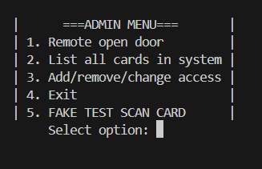
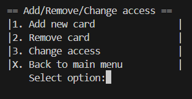
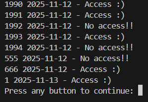

# Card Access Simulator

A lightweight C-based system for simulating card access control.  
Users can fake-scan cards, add/remove cards, modify access levels, 
and list all cards stored in the system.

The project demonstrates secure memory handling using malloc, 
realloc, and free, as well as robust input handling via safe input 
functions to avoid buffer overflows and crashes.

## 📌 Features

- Fake card scanning to simulate door access
- Add new cards to the system
- Remove existing cards
- Modify access levels
- List all stored cards
- Dynamic memory management using `malloc`, `realloc`, and `free`
- Safe input routines for preventing buffer overflow


## Example Screenshot

<p align="center"><strong>Admin Menu<strong></p>
<p align="center">

<p align="center"><strong>Add/Remove/Menu<strong></p>
<p align="center">

<p align="center"><strong>List of Cards<strong></p>
<p align="center">



##  Getting Started

### Prerequisites
- GCC-compiler

### Build
```bash

